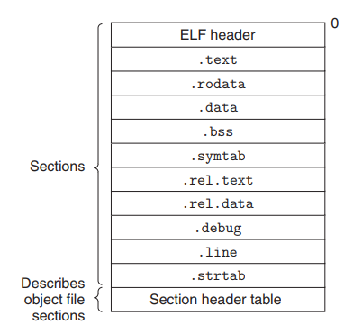

### 7.2 静态链接
  为了构建可执行文件，链接器需要执行两个主要任务：  
  1. *符号解析。* 对象文件定义并且引用符号，其中每个符号对应一个函数、全局变量或静态变量（用static声明的C变量）。符号解析的目的是使每个符号引用准确关联到一个符号定义。
  2. *重定位。* 编译器和汇编器生成代码和从地址0开始的**数据段**。链接器把每个符号的定义和对应的内存地址关联起来，从而重定位这些**数据段**，然后修改所有指向符号的引用使他们指向相应的内存地址。链接器使用汇编器产生的重定位条目(relocation entry)的详细指令，不加甄别地执行这样的重定位。
### 7.4 可重定位目标文件(Executable And Linkable Format，ELF)
  典型的可重定位目标文件：  
    
  一个典型的可重定位目标文件包含：  
  **.text**：已编译程序的机器码。  
  **.rodata**：只读数据，比如printf语句中的跳转表。  
  **.data**：已初始化的全局和静态变量。局部C变量在运行时被保存在栈中，既不出现在.data段中，也不在.bss段中。  
  **.bss**：未初始化的全局和静态变量，以及所有被初始化为0的全局或静态变量。  
  **.symtab**：包含函数和全局变量信息的符号表，他们在程序中被定义和引用。（并不包含局部变量符号信息）  
  .rel.text：  
  .rel.data：  
  **.debug**：调试符号表，包含局部变量和宏定义，全局变量的定义和引用和原始的源文件。（此段数据只有编译时添加-g选项时才会生成。）  
  **.line**：源文件中的行号与.text段的机器码指令的映射关系。（此段数据只有编译时添加-g选项时才会生成。）  
  **.strtab**：一个字符串表，其内容包括.symtab段和.debug段中的符号表，以及段头部的段名字。
### 7.5 符号和符号表
  每个可重定位目标模块都有一个符号表。假设m是一个可重定位目标模块，它的符号表中包含了被它定义和引用的符号信息。  
  链接器的上下文有三种不同的符号：
  1. 由模块m定义并能被其他模块引用的全局符号。
  2. 由其他模块定义并被模块m引用的全局符号。即**外部符号**。
  3. 只被模块m定义和引用的局部符号。对应于静态函数和静态变量。
  局部变量不同于本地链接器符号，.symtab不包含任何非static局部变量，他们在运行时栈上管理。  
  特殊情况：static定义的局部变量不在运行时栈上管理，他们在.bss或.data中定义，并被赋予唯一的名字。
## 7.6 符号解析  

### 7.6.1 链接器如何解析多重定义的全局符号
  全局符号分为强弱两种：
  1. 强符号：函数和已初始化的全局变量。
  2. 弱符号：未初始化的全局变量。  

  linux链接器使用以下规则处理多重定义符号：
  1. 不允许有多个重名的强符号。
  2. 如果有一个强符号和多个同名弱符号，那么选择强符号。
  3. 如果有多个同名弱符号，那么从其中任意选择一个。  

### 7.6.2 与静态库链接
  编译和链接的过程：  
  
  1. 编译器编译源文件。
  2. 汇编器构建可重定位目标文件。
  3. 链接器链接重定位文件，生成可执行文件。
  同时，编译系统还提供了一种机制，将所有相关的模块打包成一个单独的文件，称之为**静态库（static library）**。